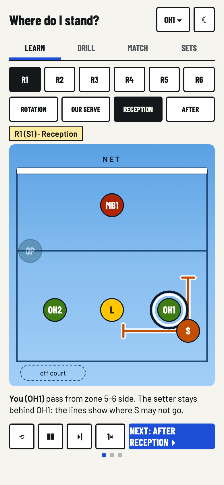
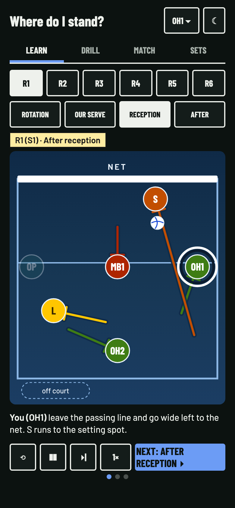

# Version 2: rebuild plan

Version 1.0 is tagged `v1.0` (`f18c97e`). Version 2 rebuilds the app one
feature at a time. Each feature was built behind a feature flag in the code
and switched on when it was done; the flags were removed in #36.

Inputs:

- the KSV guide `reference/KSV_M3.pdf`, which stays the source of truth for
  positions;
- the FIVB Official Volleyball Rules 2025-2028, which decide what is legal;
- the video "How To Run A 5-1 Volleyball Rotation (ANIMATED GUIDE)" by
  Conan Liu, M.D.: https://www.youtube.com/watch?v=LkpmYtogPdw (15:04). It
  gives the look, the animation style and some explanations.

Version 2 replaces version 1 in place, at the same URL. A v1 feature stayed
hidden until its v2 issue was done. The GitHub milestones "v2: Learn" and
"v2: Later" track the work; see "Working on v2 issues" in `CLAUDE.md`.

What version 2 changes:

1. The court is modelled on the video, with contrast fixed for a phone.
2. Our serve follows the 2025 rule, not the older rule the video uses.
3. Animated explanations show how players move between phases, including
   where the middle and the libero go.
4. There are two rule sets. The default is **Official**, the KSV guide with
   MB1, MB2 and legal libero replacements. **Simplified KSV** is a training
   convention with one middle, MB, who serves from zone 1 in R3 and R6
   (knowledge-gaps #139, #144).

## 1. Features

Every phone gets the same app, from `file://`, offline, in the tests and with
PostHog blocked. There are no feature flags: each feature below was built
behind a flag of the same key, which was on for everyone once it worked, and
#36 removed the flags and their off paths.

- **Stored keys:** `ksv51:flags` and `ksv51:ffOverride`, stored by older
  versions, are removed at start-up; a `?ff=` in the URL is ignored.
- **Version property:** `posthog.register({app_version: "2"})` runs at load,
  so every event carries `app_version: "2"`. v1 and v2 usage can then be told
  apart.

| Key | Feature |
|-----|---------|
| — | Shell: header with role button, tab bar, new court look, role picker, theme toggle, rules model with Official as the default |
| `learn-tab` | Learn: pick a rotation and a phase, see the spots, read `describe()` |
| `court-zones` | The zone numbers 1 to 6 on every court, on by default; the Zones toggle beside Next in Learn and a Zones row in Drill and Match options share `ksv51:zones` |
| `learn-animation` | Learn: animated moves between phases, with captions (section 4) |
| `passer-tag` | Learn: a "pass" tag on OH1, OH2 and L on the Reception still and in its play up to the pass, and the line "OH1, OH2 and L pass; everyone else keeps out of the lanes." |
| `common-mistakes` | Drill and solo Match: one "Common mistake: …" line after a wrong or close answer, picked from the tap |
| `rules-official` | Official mode: MB1/MB2, libero replacements, a middle serves in R3 and R6, the per-rotation exchange captions and the libero rules |
| `learn-guides` | Learn: Rules of thumb, worded for both rule sets |
| `rotations-table` | Learn: the all-rotations table. Shows the Official picture at reception |
| `drill-tab` | Drill: weighted random questions and feedback |
| `drill-review` | Drill: Review weak spots |
| `neighbour-check` | The overlap-partner bonus question, in Drill and Match |
| `answer-glide` | Drill and Match: your marker glides to the right spot after the answer, and `Watch the move` (4.7) |
| `match-solo` | Match: solo game, scoring, speed, streak, Show on court, results, replay mistakes |
| `set-call-check` | Match: set call question after the Attack step |
| `match-same-device` | Match: pass-the-device multiplayer |
| `match-online` | Match: online room on Firebase. Rooms carry `meta.v`; a client of another version cannot join |
| `sets-tab` | Sets: net diagram, explore by tapping |
| `sets-quiz` | Sets: Name the set quiz |

The all-rotations table shows Official unless the coach decides otherwise
(question 8). The printable PDF downloads are removed (#57). The planned
phase after Our serve (`after-dig`, #35, `docs/after-serve.md` stage 2) was
cancelled by the owner and never built.

### Build order

1. The shell and rules model, then `learn-tab`.
2. `learn-animation`, for Simplified.
3. `rules-official`, with the Official exchange steps.
4. `drill-tab`, `neighbour-check` and `drill-review`.
5. `match-solo`, then `sets-tab`, `sets-quiz` and `set-call-check`.
6. `match-same-device`, then `match-online`.
7. `learn-guides` and `rotations-table`.

Each step was one PR, which switched its flag on once the feature worked. It
also added a tracking event where a v1 event covered the feature. v1
analytics events stay the same.

## 2. Look

The video is flat and calm: a sky-blue court, plain coloured circles, thin
lines. Version 2 keeps that and fixes what fails on a phone: low-contrast
labels, a court that vanishes in dark mode, and text on a gradient.

| Light | Dark |
|-------|------|
|  |  |

The mock-ups show layout and colour. Their captions are placeholders, not
checked wording.

### 2.1 Gradient only inside the court panel

- The page keeps its current `--bg`, `--panel` and `--ink`.
- Buttons, tabs and cards keep the current `--accent`: `#1d4ed8` light,
  `#6c9cf5` dark. The sky blue is not the accent: white text on `#5aa1e3` is
  2.75:1.
- The court panel is a rounded card with the gradient behind an SVG. It
  replaces the wood floor.
- The only text on the gradient is the `NET` label. The caption sits outside,
  on `--panel`.

### 2.2 Tokens

Contrast ratios are WCAG 2.x. Text needs 4.5. Shapes and lines need 3. The
tokens go on `:root` next to the current ones.

**Court tokens**

| Token | Light | Dark | Check |
|-------|-------|------|-------|
| `--court-g0` / `g1` / `g2` (top / middle / bottom) | `#5aa1e3` / `#88bef0` / `#a3cff7` | `#0f2a47` / `#173754` / `#1b3d63` | Video values in light |
| `--court-line` (sidelines, end line, 3 m line) | `#1f4a7a` | `#8db8e6` | 3.3 to 5.5 light; 5.4 to 7.0 dark |
| `--net` | `#ffffff`, 0.3 unit edge in `--marker-edge` | `#ffffff` | The edge keeps it visible on light |
| `--net-label` | `#0b1b2e` | `#eaf2fb` | 6.3 light; 12.9 dark |
| `--marker-edge` | `#0b1b2e` | `#eaf2fb` | 9.7 on the dark bottom |
| `--ring` / `--ring-gap` | `#0b1b2e` / `#ffffff` | `#ffffff` / `#0b1b2e` | Your player, see 2.4 |
| `--halo` (under routes) | `rgba(255,255,255,.85)` | `rgba(15,42,71,.85)` | See 2.5 |
| `--tag` (title tag) | `#ffeca1`, text `#1a1a1a`, 1 px border | same | 14.7 |

**Role tokens.** The fills are the same in both themes, so a role is one
colour everywhere. The role picker swatches use them too.

| Role | Video | Version 2 fill | Label | Contrast |
|------|-------|----------------|-------|----------|
| S | `#dc5b05` | `--role-s: #c24e00` | white | 4.79 (video 3.79 fails) |
| OP (video: RS) | `#1e535e` | `--role-op: #1e535e` | white | 8.56 |
| MB | `#ae2500` | `--role-mb: #ae2500` | white | 6.85 |
| OH | `#488918` | `--role-oh: #3f7d14` | white | 5.05 (video 4.31 fails) |
| L | `#ffc600` | `--role-l: #ffc600` | `#3a2a00` | 8.82 (white is 1.58) |

**Routes in dark mode.** The fills are too dark for lines on the dark court.
Routes use lighter tints of the same hue:

| Role | Dark route | On `#1b3d63` |
|------|-----------|--------------|
| S | `#ff8a3d` | 4.7 |
| OH | `#7cc24a` | 5.1 |
| MB | `#ff7a5c` | 4.3 |
| OP | `#5fb8cc` | 4.9 |
| L | `#ffc600` | 7.0 |

In light mode routes use the fills, except L: `#ffc600` is 1.58 on the
white halo, so the light L route is `#9a7600` (3.7 or more on the halo).

**Marker edge.** Every marker has a 1 unit `--marker-edge`. In dark mode the
fills sit at 1.3 to 2.6 against the court without it. In light mode it keeps
L visible (1.25 without it).

**Colour blindness.** MB (red) and OH (green) can look alike. Every marker
always carries its role text. Never drop the label, including on faded
markers.

**Kept from the video:** the gradient hue, the pale yellow title tag, the
white net, the role hues. **Dropped:** the `#7eb5e8` court outline (1.1:1)
and the grey 3 m line (1.45:1). Both carry meaning, so they use
`--court-line`. The font stays Barlow and Barlow Condensed.

### 2.3 Court

- **Proportions:** true 9 × 9 m, so the court is square. The video's 1.5:1
  does not fit a portrait phone.
- **SVG viewBox:** `-4 -14 108 127`. The court is 0..100 on both axes, so a
  spot `(x, y)` from `data.py` is `(100x, 100y)`. The 14 units above the net
  hold the `NET` label. The 13 units below the end line hold the server and
  the "off court" pill, where the libero waits.
- **3 m line:** at `ATTACK_LINE` 0.42, as in the guide.
- **Markers:** diameter 12 units, about 40 px on a 390 px phone. The tap
  target is an invisible 44 px circle. The closest pair in `data.py` (OH1 and
  S, R1 reception) is 49 px apart, so hit areas do not clash.
- **Minimum marker size:** 36 px. Below that, shrink the court height cap,
  not the markers.
- **Label:** Barlow Condensed 700, 5.2 units (about 17 px), role and number,
  for example `OH1`. L's label is `#3a2a00`.
- **Zone numbers:** on by default, on every court. The "Zones" toggle beside
  Next in the Learn controls row and the Zones row in Drill and Match options
  switch them for every view. They are drawn in `--court-line` at 40% opacity,
  under the markers: front row just in front of the 3 m line, back row by the
  end line (knowledge-gaps #105, #129).
- **Hidden teammates:** in Drill and Match, "Nobody" removes them from the
  DOM. This stays the default.
- **Attack step (Drill and Match):** before the answer everyone stands on
  their reception spot (place A), teammates faded, you ringed with a "from"
  label, the ball held by the passer (`PASSER`) and a dashed pass line to
  the set spot. A tap draws a line from A. Show on court has no effect and
  the step scores ×1 (#81).
- **Faded teammates** (Learn, "Only me"): 35% opacity, label kept, no pointer
  events.
- **OM** (Simplified R3 and R6, the other middle): middle fill with a dashed
  edge, so it is not mistaken for MB or a faded player.
- **Boundaries (T-bars):** your own overlap limits. One line per overlap
  partner, from your marker edge along or across the court to the line that
  partner sets, in the partner's route colour, with a 6.4 unit T-bar at the
  end. A limit inside your marker has no line. The caption names every
  partner ("Overlap: stay in front of L, right of OP and left of OH1."),
  then each limit without a line ("You stand right at the L limit.").
  Shown only in Rotation and Reception, and only when you are on court.
- **Ball:** a flat white circle, 6.4 units, a 0.5 unit `--marker-edge`
  outline and two blue seams. It flies passer → setter → hitter.
- **Off court:** a dashed pill, "off court", in `--court-line`, bottom left
  under the end line.

### 2.4 Your player

- Two rings: an outer 1.2 unit `--ring` and an inner 1.2 unit `--ring-gap`.
  Light: navy over white. Dark: white over navy. A single white ring reads
  1.6 to 2.8 on the light court.
- In "Only me" and "Setter" views your marker is 100% size and the others
  90%.
- No glow. A permanent glow looks like a selected state.

### 2.5 Routes

- A 1.1 unit line in the mover's route colour, with a T-bar end, over a
  2.6 unit `--halo`. The halo keeps the line readable on the gradient (4.8 to
  8.6 in light mode).
- Routes start and end at the marker edge.
- Routes show in Learn and in the Drill and Match feedback. Never during a
  question.

### 2.6 Title tag

- The yellow tag reads `R1 (H1) · Reception`. The label format is
  `R1 (H1)`: H is Danish *hæver* (setter) and the number is the setter's zone.
- It sits on its own row above the court, left aligned.
- In Drill and Match it replaces the current card heading, so it costs no
  height.
- It is the only place the rotation label lives. It is the live region that
  screen readers announce.

### 2.7 Phone layout (390 px)

Top to bottom in Learn:

| Block | Height (px) | Notes |
|-------|-------------|-------|
| Header | 70 | Title, role button, theme button. The subtitle shows on the first visit only |
| Tab bar | 44 | At the top. Four tabs, no caption line under the labels below 600 px |
| Rotation chips `R1`..`R6` | 52 | One row of six |
| Phase chips | 52 | `Rotation`, `Our serve`, `Reception`, `After`. The full name is in the tag |
| Title tag | 28 | |
| Court panel | at most 358 × 421 | Height cap, see below |
| Caption | 46 | Two lines, fixed height |
| Controls row | 48 | Sticky to the bottom edge |

- **Role button:** `Outside 1 · Simplified ▾` (below 480 px `OH1 ▾`
  over `Simplified` on a second line, #127, knowledge-gaps #156) in the
  header's top-right corner replaces the "Playing as" bar. It unrolls a
  dropdown list under it, with no backdrop: a title and Close, the Rules
  switch, then the roles one per line. A pick applies at once and closes
  the list; so do Close, a tap outside, Escape and a second tap on the
  button (#76). A rules pick shows a one-line note on what changed for
  your role (knowledge-gaps #158). At 390 px the title wraps to two
  lines, so the header is about 70 px.
- **First visit:** the list opens by itself with "Pick your role", the
  Rules switch and no role ticked (knowledge-gaps #157). It asks until a
  role is picked, and also closes on Close or a tap or a focus move
  outside the list. The tap that closes it does nothing else.
- **Tab bar at the top, not the bottom.** A bottom bar collides with the
  sticky controls and the iOS Safari toolbar.
- **Court height cap:** `calc(100svh - 330px)`, with a 381 px floor so
  markers stay at 36 px or more. The width follows the height. At 390 × 750
  the court is about 358 × 420. At 390 × 664 it is 324 × 381 and the page
  scrolls a little; on phone screens up to 700 px high the gaps above the
  court shrink, so every marker opens above the sticky Next row.
- **Sticky controls in Learn:** `position: sticky; bottom: 0` on `--panel`
  with a top border. The row holds `Next: … ▸`, which steps through the
  phases and on into the next rotation, and with `learn-animation` the
  Replay, Pause, Step back, Step and speed buttons (section 4.4). The row is one line,
  57 px: the stage dots sit on its top border and Next drops the `Next:`
  word (the aria-label keeps it). When a phase starts playing, the page scrolls
  just enough that the court and caption sit above the row (about 50 px at
  390 × 750, 100 px at 390 × 664). Header, tabs, chips, tag, court and caption fit above
  the fold at 390 × 750, and the primary action is always visible.
- **Match:** the button row stays non-sticky while answering, as in v1.
- **Desktop:** the column stays 688 px wide and centred. The court is capped
  at 480 px wide.

## 3. Our serve (2025 rule) and overlap timing (2026)

The video is out of date here. At 4:31 it says "as soon as the ball is
contacted the rules of rotation no longer apply". Its Service slides bunch the
front row in the middle, then show SWITCH.

Version 2 teaches the current rule (FIVB 2025-2028 rule 7.4, used by
Volleyball Danmark since September 2025). The rule says: "The players of the
serving team, however, are free to occupy any position at the service hit."

- **When we serve, there is no overlap rule.** Nobody has to stay in order
  with their neighbours. We still serve in the correct service order.
- **Rows still count.** The row is fixed by the rotation, not by where you
  stand. Only front-row players may block. A back-row player may attack at
  any height only if the take-off foot has not touched or crossed the 3 m
  line. After the hit they may land inside it. From the front zone, a
  back-row player may only hit a ball that is partly below the top of the
  net.
- **Before the serve, everyone except the server stands in their base
  spot.** There is no bunching and no switch. The server serves from
  anywhere behind the end line and runs to their base spot. The app draws
  only that arrow.
- **Base spots stay spread out.** A group standing together to hide the
  serve is a screen (rule 12.5).
- **The overlap boundaries (T-bars) show only in Rotation and Reception.**
  They are the limits at the referee's whistle, not during the pass (see
  below).

**When overlap is checked (from 1 October 2026).** Volleyball Danmark rules
from 1 October 2026 (KSV board mail, 28 September 2026): the receiving team
must be in correct rotational order when the referee whistles for the serve.
From the moment the server's movement starts, players may move freely; no
rotation fault is called on positions after that. The serving team was
already free (7.4). Rows still count for blocking and back-row attack.

- The Rotation caption ends with "This is your rotation order. It counts at
  the whistle when the other team serves. We serve now, so you may stand
  anywhere." Reception ends with "These limits count at the whistle, not
  during the pass. From the server's first movement you may move."
- In Official R3 and R6 the middle who serves from zone 1 has no overlap
  limits at the Rotation step, and is nobody's limit: when they serve, the
  libero is in for that middle.
- The neighbour check asks "Who must stay behind you at the whistle?", and
  its answer says to keep that order at the whistle.
- The reception spots stay as the guide draws them: they are legal at the
  whistle, and `tests/audit.py` still checks their overlap.
- Whether KSV uses the new freedom (an earlier setter release, a stacked
  reception legal only at the whistle) is a coach question (#16).

Where the app explains the rule, it says why: "The serving team may stand
anywhere: the overlap rule is only for the receiving team. You stay in your row for play: a back-row
player may not block, or attack from the front zone above the net."

This keeps the v1 `serve` phase and `BASE_DEF`. The video contributes only
the look of the server's run.

## 4. Animated explanations (`learn-animation`)

The video's strength is watching every player move at once. Each Learn
screen shows its phase as a still picture. The animation shows what happens
next in that phase, not the move from the previous screen (owner, #47). It
plays only on Play (owner, #60). Rotation and Reception animate; Our serve
and Base are static (owner, #69, #94). Rotation's play builds its still
picture from the setter (#146, knowledge-gaps #135). Reception's still picture is
the reception spots at the whistle, and its play runs on to base defence and
fades back to them (owner, #65). Learn's fourth screen is Base:
base defence after our attack (#55).
Drill and Match keep grading the attack spots in that step and call it
Attack.

### 4.1 What plays

| Phase | Still picture (at rest) | What plays |
|-------|---------------|------------|
| Rotation | Rotational lineup with your overlap limits at the whistle | Starts on an empty court; one marker fades in on its spot per stage, nobody runs and there is no ball: 1 the setter, 2 the opposite on its diagonal, 3 OH1 one zone on (next after the setter in the serving order), 4 OH2 on OH1's diagonal, 5 the front middle in the empty front spot, 6 L in the empty back spot (Official R3/R6: the serving middle in zone 1, L off). Each stage holds its line for 2.5 s, and the caption shows every stage's line. It ends on the still with the limits, with no fade-back |
| Our serve | Base spots, the server at base with the route from the serve spot, the ball over the net on their side | Nothing. No controls (#69) |
| Reception | The reception spots from the guide with your overlap limits at the whistle and the reception cue. No ball | Starts on the still picture at once, with no lead-in; the limits go. 1: their serve comes to the passer (`PASSER`: L, OH1 or OH2 by rotation, guide rule 01); at the contact the setter and every front-row attacker who does not receive leave for their `ar` spots. 2: the pass flies to the setter; the passer and the other receivers go to their `ar` spots (L and the back-row outside hitter run straight on to their cover spots, and a back-row opposite, who waited out of the passing lanes, runs straight to its cover), and the front-row middle runs its quick approach from its `ar` spot in the middle of the front zone (`QUICK_START_Y` 0.26, in front of the 3 m line, so the back-row hitter's lane stays clear) to take-off about 1.5 m off the net (`APPROACH_Y`) left of the setter, arriving as the ball reaches the setter. Detours stay inside the court. 3: the set goes to the zone 4 hitter, who approaches outside-in (the hit 0.08 inside its start), and a 3-2 cover forms (`COVER`): the setter, the middle and L stand about 3 m from the hitter, behind and inside it and clear of its approach, in an arc from the setter (nearest the net) to L; the middle fakes the quick first and only drops back (never towards the net); two deep covers stand behind the gaps (`DEEP_COVER`): the back-row outside hitter at (0.44, 0.56) and the other attacker at (0.62, 0.44) (in R1 to R3 the front-row right-side attacker comes in from the sideline, in R4 to R6 the back-row opposite does not approach). The set flies until the close cover stands, at most 1.1 s, and lands as the hitter's run ends; a cover who is late covers from where it is. 4: the spike goes over the net into their court; everyone goes to base defence by job, a back-row setter to zone 1. Then the markers, trails and ball fade out (400 ms) and the still picture fades back in |
| Base | Base defence by job (`BASE_DEF`), the ball over the net on their side. No routes; the overlap limits do not apply | Nothing. No controls (#94); Reception's stage 4 plays how the team gets here |

- Our serve is the first serve of the rotation. Serving more points does not
  rotate.
- The ball shows on the Our serve and Base stills, over the net. Rotation
  and Reception show none. It never covers a label.
- The app has no phase for the rally after our attack until `after-dig`. No
  "go to base" banner shows at Base.
- Nothing animates between screens: no rotate step, no exchange walk, no
  middle pair reset. The exchanges and the reset are told in the still
  caption instead (4.5).

### 4.2 When it plays

- **The primary button and the chips go straight to the new still
  picture.** `Next: Reception ▸` moves the tag, the players and the
  caption at once. On Reception it reads `Base ▸`; after the last phase
  `Next: R2 (H6) ▸`. It follows `STEP_ORDER`.
- **Nothing plays on its own** (owner, #60). Next, the chips, the arrow
  keys, loading the page and a tab, role or rules change open the still
  picture. Only Play, Replay and Step play.
- **Play** runs Reception from its still picture to base defence, then
  fades back to the reception spots. Replay does the same. Pause and
  Step keep the frame they stop on; Step stays on Reception's last stage.
  Step back goes to the end of the stage before, and never plays.
- **Nudge:** each time Reception opens (Next, a chip, an arrow
  key, the page load or the Learn tab), Play gives one pulse (700 ms): colour
  only, the fill and border to `--accent` and the icon to `--on-accent` and
  back, with no change of size or position. It never loops and stops when a play starts. With
  reduced motion or `?anim=0` the controls are hidden, so there is none.
- Next never waits: a tap mid-play opens the next screen at once.

### 4.3 Timing

| Item | Value |
|------|-------|
| Glide | 2.5 s per court width at 1× (at least 400 ms), eased in and out over the first and last quarter, so no run is faster than about 5 m/s (1 unit = 9 m) |
| Same stage | Players start together unless someone is in the way: the planner may hold a start (up to 1.3 s) or route round the player met, never turning back. At the serve contact attackers never wait; the setter waits only for an attacker in front of the set spot (R2) |
| Stage length | The ball's flight plus 150 ms for the next contact, so the ball never waits in a player's hands (#71). The last stage lasts until every move is done, at least 600 ms |
| Long runs | A run longer than its stage carries on into the next stages (L's cross-court run, the setter's run from zone 1); the player's next move starts when it ends, and the planner keeps `GAP` from it |
| Hold | 900 ms after the last stage only; the markers stay where they are, which is the still picture; at Reception they then fade out over 400 ms and the still fades in over 400 ms |
| Ball | Their serve 1 s; the pass at least 1 s and until the setter is at the set spot, the middle arriving at take-off as it lands; the set lands when the hitter arrives; the spike 450 ms |
| Caption | Your own line only; it changes when you get a new one and stays at least 2.5 s of play (5 s at 0.5×); a line due later waits, and lines still waiting when the play ends are dropped. Cross-fades over 150 ms |
| Reception | About 5 to 7 s at 1×, twice that at 0.5× |

### 4.4 Controls

One bar at the bottom of the court panel, under the court drawing and the
"off court" pill. The buttons show on Reception only; the bar
keeps its height on Rotation, Our serve and Base:

| Control | Behaviour |
|---------|-----------|
| `⟲` Replay | Plays the current phase again |
| `❚❚` / `▶` | Pause and play |
| `◀\|` Step back | Pauses on the end of the stage before; from the first stage, on Reception's still. During the fade-back it goes to the end of the last stage, and in the end hold to the stage before the last. Disabled on the start picture and while playing. Step and Play go on from there |
| `▸\|` Step | Runs one stage and pauses. Disabled while playing. On Reception's last stage it stays |
| `1×` / `0.5×` | Speed, stored in `ksv51:animSpeed` |

- The small buttons are 44 × 44 with 4 px between them. The speed button is 52 wide.
  The bar fits a 324 px court panel (390 × 664).
- Stage dots sit at the left of the bar. The dots up to the playing stage
  are filled; none at rest. They are not buttons.
- The sticky row under the caption holds only the primary `Next: … ▸`.
- **Ball:** a small volleyball (white, a blue and a yellow panel, dark
  seams), 0.65 × the marker radius. It meets a player at the marker edge,
  not the centre, so the label stays readable.
- **No overlap:** at every moment, moving or not, two markers stay at least
  a marker width plus its ring apart; a mover stops short of anyone standing
  on its spot and goes round anyone in its way, behind rather than in front.
  Front-row players who switch sides after the spike pass behind the middle.
  Their caption says "cross behind the middle", and any other run to base
  more than 0.3 across the centre line says "cross" (#73).
- **Trails:** each move leaves a faded dashed line (60%) in the player's
  route colour along its path. A trail shows through its stage and while its
  run carries on, then fades out over 400 ms. They stay
  through the hold, Pause and Step; the still picture, Replay and a screen
  change clear them.
- `Show everyone` / `Only me` is not built; Learn shows everyone. `Zones`
  is a toggle beside Next (#41, #130).
- Your player has the ring. The caption starts with your move in bold:
  "**You (OH1)** …".

### 4.5 Captions

- One sentence per stage, at most 90 characters (two lines at 15 px).
- Fixed two-line height, so the layout does not jump.
- Announced through an `aria-live="polite"` region. The tag is not
  announced twice.
- Say why, in plain words.
- Captions are per rotation. They come from the `move` notes in `data.py`,
  one per player per phase. Reception uses the `rec` notes while the serve
  comes and the `ar` notes of the setter and the attackers; the passer and
  the setter get a fixed pass and second-contact line. The set and spike
  stages have fixed lines per job (hitter, close cover,
  deep cover, setter, base defence), with the hitter's name and the zone
  filled in; the last stage's line is the caption at Base.
- Each caption is checked against the guide's arrows and `note` for that
  rotation. Not every hitter leaves the net the same way. In R4 to R6 the
  opposite goes to zone 1 as a back-row attacker.
- Examples:
  - "**You (S):** Leave zone 1 for the setting spot as soon as the serve is
    hit."
  - "**Middle:** Step off the net to the middle of the front zone to open for the quick."
- A `move` note is written to its player, at most 78 characters, so the
  bold prefix still fits in 90. When you do not move in a stage, the caption
  keeps your last line; only a stage before any line of yours shows the
  stage's lead mover.
- After a Reception play has run to its end and faded back, the still
  caption keeps the reception cue, and under it a short numbered "Then:"
  list gives your line for each of the four stages (the reduced-motion
  list). It goes when you leave the screen or play again.
- At rest the still caption says why you stand there. At Base it is your
  base defence line: "Our attack is over
  the net: defend.", with no overlap limits. Otherwise it is your libero
  exchange, or the Simplified middle pair going back to MB at the net and L
  in zone 1 at Reception in R3 and R6, when this screen follows one; else
  your `move` note for the phase. When it is not yours, it names who
  changes. Rotation has no caption otherwise. In R3 and R6 the libero, off
  court at Our serve, is told to wait at the sideline while the middle (MB in
  Simplified) serves.
- Exchanges happen at the right sideline by the 3 m line. The Official
  exchange captions name the players of that rotation (4.9).

### 4.6 Reduced motion and `?anim=0`

- With `prefers-reduced-motion: reduce` or `?anim=0`: no glide. `Next`
  cross-fades to the still picture (150 ms, or 0 ms with `?anim=0`). Routes
  show at once. Reception shows the reception spots and the overlap limits,
  as with the animation; Our serve shows the server at base.
- On Reception the caption lists its four stages, the still caption first
  when it is an exchange. Our serve shows its still caption only. Base shows
  base defence and its caption.
- Replay, Pause, Step back, Step and speed are hidden. The primary button stays.
- The Playwright tests use `?anim=0`, plus `anim_test.py`, which plays
  Reception and checks the stage and end positions.

### 4.7 Drill and Match

Scoring speed must not slow down, and Next never waits.

- **No multi-stage animation between questions.** Teammates are hidden by
  default, so a glide would show nothing.
- **After the answer:** your marker glides from your tap to the correct spot
  in 400 ms, with a haloed route. The correct spot is a ring outline. The
  buttons are already active, and Next cuts the glide short.
- **`Watch the move`:** an optional text button under the answer, at
  Receive and Attack only (Rotate and Our serve are static, #69). It plays
  Learn's Reception play for your role, in the same court, with the Learn
  controls, then fades back to the answer. Next closes it. Rotate glides each
  placed marker to its right spot.
- **Same-device and online:** no motion during a turn ("Answer saved" only).
  All motion happens on the reveal screen: each role's marker glides from
  the first tap for that role, and `Watch the move` plays for your role
  online, or for the one role on the same device (no ring with several
  roles). Online, `Watch the move` shows only on the reveal.
- **Reduced motion:** the correct spot and route appear at once.

### 4.8 Implementation

- One SVG `<g>` per player. Interpolate `x` and `y` in
  `requestAnimationFrame` and set `transform` once per frame. No CSS
  transitions, so Step, Pause and speed are exact.
- Cancel the frame loop on tab change and on `visibilitychange`.
- The court has `touch-action: manipulation`. Markers ignore taps while a
  phase plays.
- Positions come from `players(ri, phase)`, so the animation cannot drift
  from the data.
- `planStage()` places each mover in turn, shortest move first (or in the
  stage's order): the cheapest start delay and path (straight, or round one
  player met through one waypoint, never turning back and at most 1.3 times
  the straight line) that keeps `GAP` (a marker width plus its ring) from
  everyone, sampled every 15 ms, including runs carried on from an earlier
  stage. A detour stays in front of y 0.85 unless the run starts or ends
  deeper, so L crosses in front of the passer, not along the end line (#71).
  Stages are built once per rule set, rotation and phase.
- Nothing is added to the single file beyond the script.

### 4.9 Libero replacements (Official)

From the KSV `liberofor` and serve lineups:

| Rotation | Front-row middle | Libero in reception replaces | Rotation and Our serve |
|----------|------------------|------------------------------|------------------------|
| R1 (H1) | MB1 (zone 3) | MB2 (zone 6) | L stays on for MB2 |
| R2 (H6) | MB1 (zone 2) | MB2 (zone 5) | L stays on for MB2 |
| R3 (H5) | MB2 (zone 4) | MB1 (zone 1) | **L off.** L leaves and MB2 comes on in zone 4. MB1 is in zone 1 and serves |
| R4 (H4) | MB2 (zone 3) | MB1 (zone 6) | L stays on for MB1 |
| R5 (H3) | MB2 (zone 2) | MB1 (zone 5) | L stays on for MB1 |
| R6 (H2) | MB1 (zone 4) | MB2 (zone 1) | **L off.** L leaves and MB1 comes on in zone 4. MB2 is in zone 1 and serves |

- In R3 and R6, when we lose the serve, the libero comes on for the middle
  who has been serving. This is a second replacement, and the serve was the
  completed rally between the two.
- The still caption tells each replacement at the sideline by the attack
  line: one player walks off, the other walks on. Nothing animates (4.1).
- Captions are per rotation. At the Rotation step of R3 and R6, L, the
  middle who comes on and the serving middle each read their own line;
  everyone else reads:
  - R3: "The libero leaves; MB2 comes on in zone 4. MB1 is in zone 1 and
    serves."
  - R6: "The libero leaves; MB1 comes on in zone 4. MB2 is in zone 1 and
    serves."
- The rule does not fit the 90-character caption, so the hint under the
  Next button states it on the Rotation and Reception screens of R3 and R6:
  "Libero rules (FIVB 19.3): the libero replaces only a back-row player and
  may not serve, block, or attack a ball above the net. A completed rally
  must come between two replacements."
- L's Attack text in Drill and Match (`describe()`) and L's Base cue in
  Learn add: after the libero sets with fingers from the front zone, nobody
  may attack that ball above the net.
- `ROWS.back` has L in zone 1 in R3 and R6, which is the reception picture.
  In Official the Rotation step shows the real lineup: the serving middle in
  zone 1 and L off (`middleServes()`). Question 1 can still change this.

The video lets the libero serve in R3. That is a US rule. Its R3 slide also
has the libero step out and straight back in, with no rally between, which
is illegal under rule 19.3.2.1. Version 2 shows neither.

## 5. Rule sets

The `rulesMode` switch has two values: `official` (default) and `simple`.
With no stored `ksv51:rulesMode` the app runs Official; a stored choice is
kept (knowledge-gaps #139). While `rules-official` is off it runs Simplified.
v1's Drill mode (the libero serves in R3 and R6) is dropped until the coach
answers question 2. A stored `ksv51:rulesMode` value of `drill` maps to
`simple`. The meaning changes: in v1 Drill the libero serves, in Simplified
MB serves.

### Simplified KSV

Simplified KSV is a training convention, not a match lineup. Use it when only
one middle is there. In a match both middles play and the libero cannot
serve. The app says this in the Rules switch.

- **One middle, `MB`, always in the front row.** MB stands where the
  front-row middle stands in the guide and makes that middle's moves: MB1's
  in R6, R1 and R2; MB2's in R3, R4 and R5.
- **The libero always plays the back-row middle's spot.** The two middle
  slots are opposite: one in front, one behind.
- **In R3 and R6 MB serves, as the middle does in Official** (owner,
  2026-10-03). MB rotates from zone 2 to zone 1 and serves, then defends
  zone 5, the libero's spot; the outside hitter takes zone 6. The libero may
  not serve, so L is off, and the other middle (`OM`, middle colour, dashed
  edge, "the other middle" in captions) comes on in zone 4. MB keeps serving while we win points.
- **When we lose the serve, the pair goes back to the convention:** OM goes
  off, MB goes to the net in zone 4 and L comes on in zone 1, so Reception
  uses the guide's spots.
- **Role picker:** `MB OH1 OH2 OP S L`. MB1 and MB2 appear only in Official.
  OM is not a pickable role.

**Data.** Simplified is derived from the official data, not typed twice.
`lineup(ri, mode)` renames the official front-row middle to MB; at our serve
in R3 and R6 it names the serving middle MB and the front-row middle OM; no
spot moves. `rotation_lineup(ri, mode)` gives the Rotation step (the server
in zone 1, L off). `middle_pair(ri)` returns the reception zones of MB and L. `build.py` emits both
rule sets and the app swaps `ROWS` on a switch. `tests/audit.py` checks both
modes and the walk-through tables below.

### Official (`rules-official`)

- A restore of v1's `official` mode: the KSV guide positions with MB1 and
  MB2.
- The libero replaces the back-row middle in reception, and is off court
  while a middle serves in R3 and R6 (section 4.9).
- Rule texts explain why, as in v1, and add the libero rules.
- New in v2: the per-rotation replacement captions.

### Walk-through: Official

Lineups read front 4-3-2 / back 5-6-1. The server runs from zone 1 to their
base spot.

| Rot | Rotation step (real lineup) | Our serve (base spots) | Reception | Attack |
|-----|-----------------------------|------------------------|-----------|-----------------|
| R1 (H1) | OP MB1 OH1 / OH2 L(MB2) S. L stays on | OH1 MB1 OP / L OH2 S. S serves | L for MB2 (zone 6). MB1 front | OP, MB1, OH1 attack; S sets from 0.69, 0.10 |
| R2 (H6) | OH2 OP MB1 / L(MB2) S OH1. L stays on | OH2 MB1 OP / L OH1 S. OH1 serves | L for MB2 (zone 5) | OH2, MB1, OP attack |
| R3 (H5) | L leaves, MB2 on. MB2 OH2 OP / S OH1 MB1. MB1 in zone 1, L off | OH2 MB2 OP / MB1 OH1 S. MB1 serves | After the serve rally: L for MB1 (zone 1) | OH2, MB2, OP attack |
| R4 (H4) | S MB2 OH2 / OH1 L(MB1) OP. L stays on | OH2 MB2 S / L OH1 OP. OP serves | L for MB1 (zone 6) | OP goes to zone 1, back-row attack |
| R5 (H3) | OH1 S MB2 / L(MB1) OP OH2. L stays on | OH1 MB2 S / L OH2 OP. OH2 serves | L for MB1 (zone 5) | OP back-row attack |
| R6 (H2) | L leaves, MB1 on. MB1 OH1 S / OP OH2 MB2. MB2 in zone 1, L off | OH1 MB1 S / MB2 OH2 OP. MB2 serves | After the serve rally: L for MB2 (zone 1) | OP back-row attack |

### Walk-through: Simplified KSV

| Rot | Rotation step | Our serve | Reception | Attack |
|-----|---------------|-----------|-----------|-----------------|
| R1 | OP MB OH1 / OH2 L S | As Official, MB for MB1 | As Official | As Official |
| R2 | OH2 OP MB / L S OH1 | As Official | As Official | As Official |
| R3 | L leaves, OM on. OM OH2 OP / S OH1 MB. MB in zone 1, L off | OH2 OM OP / MB OH1 S. MB serves, then defends zone 5 | After the serve rally: OM off, MB to the net (zone 4), L in zone 1 | As Official |
| R4 | S MB OH2 / OH1 L OP | As Official | As Official | As Official |
| R5 | OH1 S MB / L OP OH2 | As Official | As Official | As Official |
| R6 | L leaves, OM on. OM OH1 S / OP OH2 MB. MB in zone 1, L off | OH1 OM S / MB OH2 OP. MB serves, then defends zone 5 | After the serve rally: OM off, MB to the net (zone 4), L in zone 1 | As Official |

In both rule sets the Rotation step in R3 and R6 shows the server in zone 1
and L off.

In both rule sets the receiving team's overlap order counts at the referee's
whistle for the serve; from the server's first movement players may move
(Volleyball Danmark, from 1 October 2026; section 3).

### What changes from v1

| | v1 | v2 |
|---|---|---|
| Default rules | Official | Official (Simplified KSV until 2026-10-03) |
| Second mode | Drill (L serves in R3/R6, middle off) | Official |
| Middle roles | MB1, MB2 | MB (Simplified); MB1, MB2 (Official) |
| Who serves in R3/R6 | The middle (Official); L (Drill) | MB (Simplified); the middle (Official) |
| Stored `drill` | — | Read as `simple` |

## 6. What comes from where

| Content | Source |
|---------|--------|
| Every reception and after-reception spot | KSV guide (unchanged `rec` and `ar`) |
| Our serve base spots | v1 `BASE_DEF` (not in the guide, coach to confirm) |
| Serving team position and rows | FIVB 7.4, 13.2.2, 13.2.3, 14.1.1 |
| Overlap checked at the whistle, free from the server's first movement | Volleyball Danmark rules from 1 October 2026 |
| Screening | FIVB 12.5 |
| Libero replacements | FIVB 19.3.1.1 to 19.3.1.4 and 19.3.2.1 to 19.3.2.4, plus the KSV `liberofor` |
| Look, markers, T-bar boundaries, ball path, motion style | Video, with contrast fixed (section 2) |
| Why the setter hides, overlap by neighbours | Video, wording checked against the rules |

**Not used from the video.** They differ from the KSV guide or from the
rules:

| Video content | Why not |
|---------------|---------|
| The libero serving (R3) | US rule. FIVB 19.3.1.3 forbids it |
| The libero stepping out and straight back in | No rally between two replacements (19.3.2.1) |
| Bunching the front row at Our serve | Not needed under 7.4, and can be a screen (12.5) |
| "Rules of rotation stop at contact" for the serving team | Out of date: under 7.4 the serving team is free, and from 1 October 2026 the receiving team is free from the server's first movement |
| Its own receive formations and "alternative" receives | Differ from the KSV guide |
| OH1/OH2 naming (1 = closest to the middle) | KSV's OH1 is a different player |
| The R1 setter stack with OH1 in zone 1 | Differs from the KSV R1 |
| The "SWITCH!" burst | No banner. The caption carries the step |

## 7. Hazards

- **Database rules:** online play validates `role` against a fixed list in
  `infra/database.rules.json`. The file accepts `MB` and `meta.rulesMode`
  `simple` (#19) and require `meta.v` (#33), but the live rules change only
  with a `terraform apply` by the owner.
- **Stored data:** bests and stats are keyed by role and rules mode. Version 2
  moves the best key prefix to `v5|`, and Simplified MB stats start empty.
  Stored `drill` reads as `simple`.
- **Contrast:** `tests/theme_test.py` gains a check that reads the court and
  role tokens and asserts the ratios in section 2.2. The next colour tweak
  cannot then break them silently.

## 8. Open questions for the coach

1. **Rotation step in R3 and R6:** show the real lineup (the serving middle
   in zone 1, L off), or L in zone 1 as in the guide's "Starting rotation"
   boxes? The same applies to MB in Simplified.
2. **One middle and nobody else:** who serves in R3 and R6? Answered by the
   owner on 2026-10-03: MB serves and the other middle plays zone 4
   (knowledge-gaps). If the libero serves in training, v1's Drill rule comes
   back as a named training option.
3. **Where the server defends in R3 and R6:** the serving middle (Official)
   (MB in Simplified) in zone 6 with the OH in zone 5, or zone 5 with the OH
   in zone 6? Owner: zone 5, the libero's spot (knowledge-gaps #145).
4. **The Simplified reset:** MB now rotates to zone 1 and serves in R3 and
   R6, and goes back to the net in zone 4 when we lose the serve (owner,
   2026-10-03).
5. **Libero out of zone 1 (Official R3/R6):** may the libero replace the
   serving middle as soon as we lose the serve, or does the middle stay in
   for the first ball?
6. **Base spots:** can the front-row base spots at Our serve stay at mid-zone
   (y 0.21), or should they be at the net?
7. **Set calls:** the guide draws "Po" and "Til"; the app leaves them out
   until someone explains them. What do they mean? The app has "4" as the
   middle's low quick in front of the setter and the back-row sets A (zone 1),
   B (zone 6) and C (zone 5). Which calls is each attacker asked?
8. **All-rotations table:** should it show Official or Simplified?
9. **Reception animation after the pass:** the app sets zone 4, has every
   attacker approach, covers in a 3-2 cup (setter, nearest front player and
   libero close) and sends everyone to base defence after the spike. Is that
   what KSV teaches?
10. **Passer and cover:** the pass rotates among L, OH1 and OH2 by rotation
    (guide rule 01); the setter, the middle and L cover close (about 3 m
    from the hitter) and the back-row outside covers deep at 5 to 6 m.
    Does KSV want one receiver to take most serves, and is this the cover?
11. **R1 side switch:** do OP and OH1 switch sides after our attack in R1,
    or stay in the reception lanes until the next dead ball?
12. **Front-row base after our attack:** at the net ready to block, or off
    the net (mid-zone, as now)? Perimeter or rotational defence?
